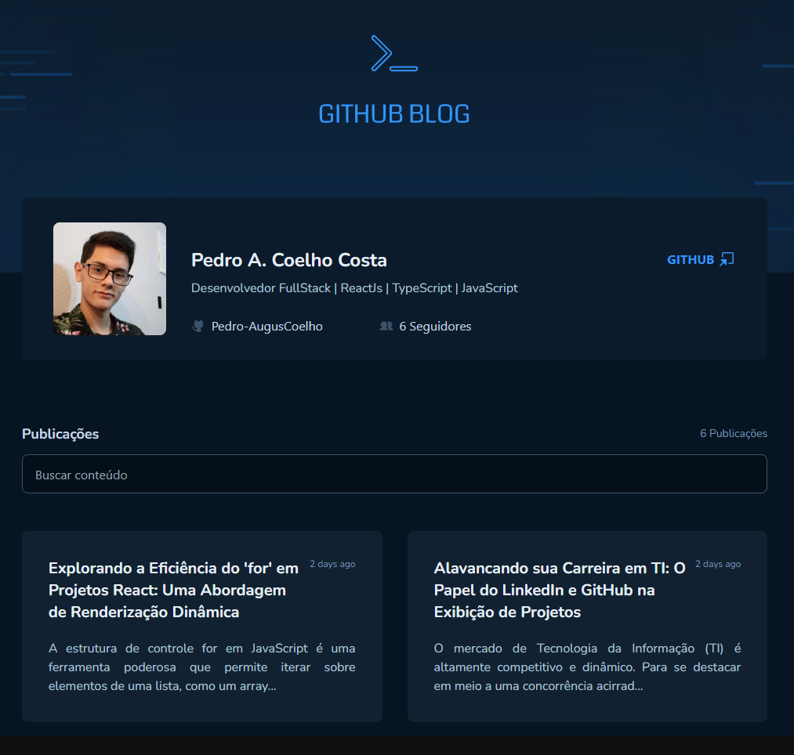

<!--<div align='center'>
  
  
</div>-->

# Sobre o projeto 💬

O **Github_Blog** é uma aplicação web desenvolvida na Rocketseat, sobre um blog pessoal utilizando a api do github

## Funcionalidades 🧠

###  📕 A aplicação contém as seguintes funcionalidades:

- [x] Visualizar o usuário que publicou as postagens
- [x] Listar as postagens
- [x] Filtar as postagens
- [x] Visualizar todo o conteúdo da postagem para leitura

## Pré-requisitos
#### Antes de começar, é bom ter instalado em sua maquina as seguintes ferramentas:
- [x] [GIT](https://git-scm.com/)
- [x] [VSCode](https://code.visualstudio.com/)
- [x] [NodeJs](https://nodejs.org/en/)

### Rodando o Projeto 📖

```bash
# Clone para este repositório
$ git clone https://github.com/Pedro-AugusCoelho/Github_Blog.git

# Acesse a pasta do projeto no terminal/cmd
$ cd Github_Blog

# Instale as dependências
$ npm install/yarn

# Execute a aplicação em modo de desenvolvimento
$ npm run dev / yarn dev

# Crie e configure o .env.local baseado no .env.example
$ VITE_RACT_APP_BASE_URL_API_GITHUB // Base url da api do github
$ VITE_REACT_APP_GITHUB_USER // Usuario do github
$ VITE_REACT_APP_GITHUB_REPO // Repositorio onde esta publicado os issues

# O frontend iniciará na porta:5173 - acesse <http://127.0.0.1:5173>
```

## Tecnologias 🛠

Desenvolvido utilizando as seguintes tecnologias:

- [REACT.JS](https://reactjs.org/)
- [VITE](https://vitejs.dev/)
- [TYPESCRIPT](https://www.typescriptlang.org/)
- [TAILWIND](https://tailwindcss.com/)
- [REACT-MARKDOWN](https://github.com/remarkjs/react-markdown)
- [PHOSPHOR-REACT](https://phosphoricons.com/)
- [REACT-HOOK-FORM](https://www.react-hook-form.com/)
- [ZOD](https://zod.dev/)
- [AXIOS](https://www.npmjs.com/package/axios)

## Desenvolvido ##

- [Rocketseat](https://www.rocketseat.com.br/index)
